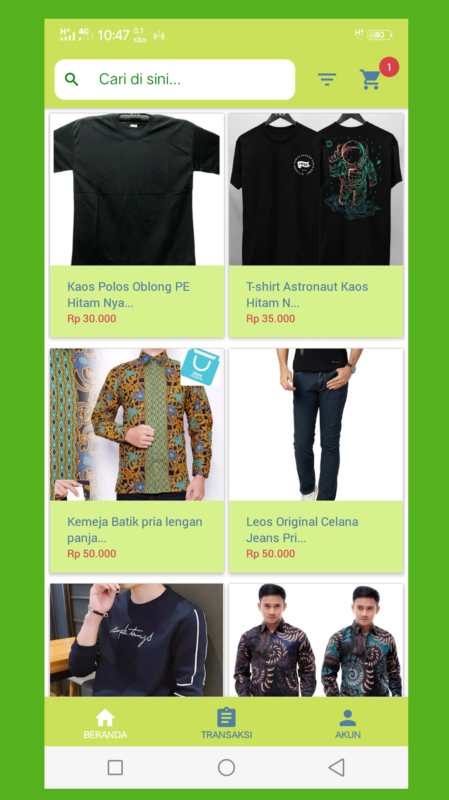
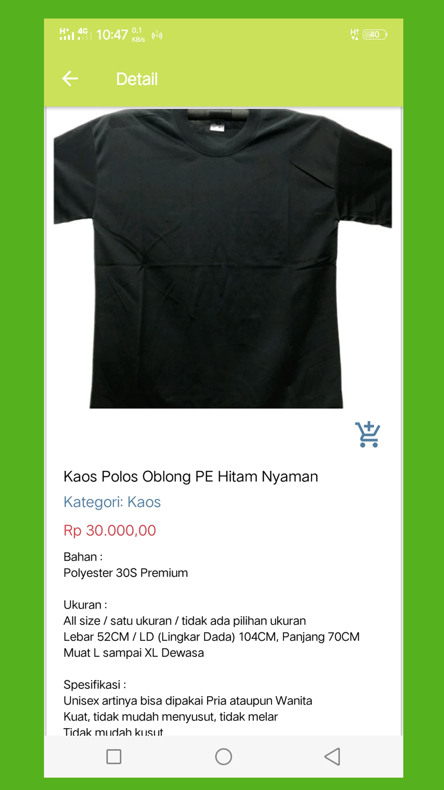
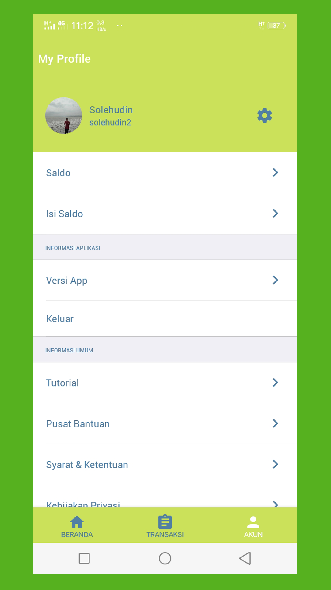

# E-Dress App 

<div align="center">
    
</div>

## Contents

- [Description](#description)
- [Features](#features)
- [Usage](#usage-application)
- [Requirements](#requirements-for-development)
- [Installation](#installation-for-development)
- [Screenshoots](#screenshoots)
- [APK Release](#apk-release)
- [Related Project](#related-project)

## Description

**E-Dress App** is a mobile-based clothing sales application that makes it easy for customers to choose the product of their choice. Applications managed by the seller, which seller can add, subtract, or withdraw their sales products.

## Features

- Order products
- History transaction
- Edit Profile
- Add products (admin only)
- Change products (admin only)
- Delete products (admin only)

## Usage Application

- [`Download`](#apk-release) and install the app in your android device
- Register new account, then login with your new account
- If you can log in, you can use the feature

## Requirements for Development

- [`Node Js`](https://nodejs.org/en/)
- [`npm`](https://www.npmjs.com/get-npm)
- [`react-native`](https://facebook.github.io/react-native/docs/getting-started)
- [`react-native-cli`](https://facebook.github.io/react-native/docs/getting-started)
- [`E-Dress Backend`](https://github.com/solehudin5699/E-DRESS-backend.git)

## Installation for Development

1. Open your terminal or command prompt
2. Type `git clone https://github.com/solehudin5699/E-DRESS-frontend.git`
3. Open the folder and type `npm install` for install dependencies
4. Create file titled **_sharedVariable.js_** in root folder with the following contents :

```javascript
export const serverAddress = "server_address_for_backend";
```

Example :

```javascript
export const serverAddress = "http://localhost:8000";
```

5. Before run this, you must installation backend and then run backend
6. Type `react-native run-android` in terminal for run this app. **_Make sure your device is connected with debugging mode_**.

## Screenshoots

<div align="center">
       
    
    
</div>

## APK Release

Download this apk release for getting experience with this app.

<a href="http://bit.ly/edress_app">

</a>

## Related Project

Restfull API for this application, clone this for development E-Dress App.

<a href="https://github.com/solehudin5699/E-DRESS-backend.git">

</a>
